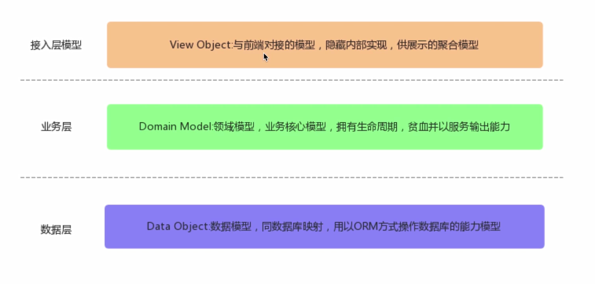
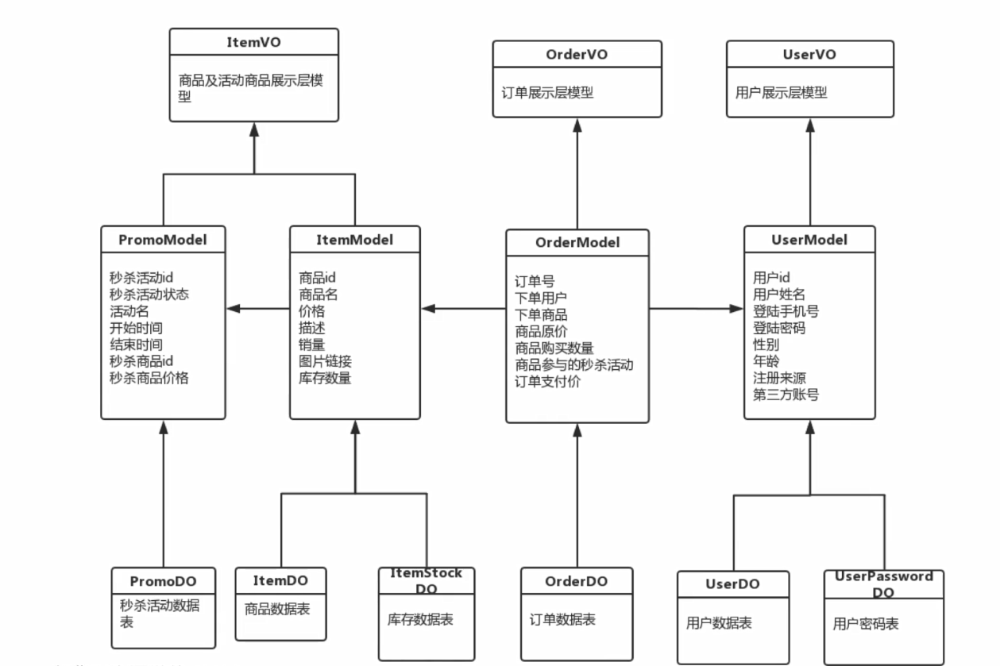
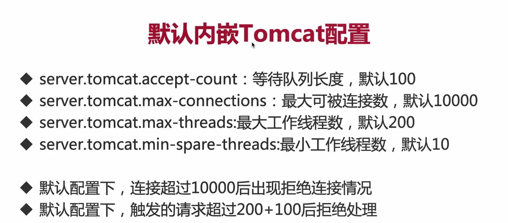

# online_bargain_dash_project
秒杀项目
## 使用技术
1. mybatis
2. springboot
3.
## 项目亮点

1. 前后端分离：
2. 使用validator进行参数校验

##项目难点实现

1. 封装CommonReturnType返回给前端结果

   {status:"success/fail",data:Object}

2. 封装BusinessError并自定义ExceptionHandler处理出现的异常错误

**各层对象模型：**

- controller：ViewObject(返回前端的对象)
- service:ViewModel
- DAO:DataObject
整体框架：
  
**允许跨域请求**：

后端：

允许跨域传输所有的header参数，将用于使用token放入header域

做session共享的跨域请求

```java
@CrossOrigin(allowCredentials = "true",allowedHeaders = "*")//允许跨域请求
```

## 数据库设计
需求设计:
1. 先根据需求设计一个数据模型Model,包含所需求需要的字段
2. 设计数据库
## 优化思路
1. 修改springboot tomcat默认配置属性
   
2. 定制化tomcat