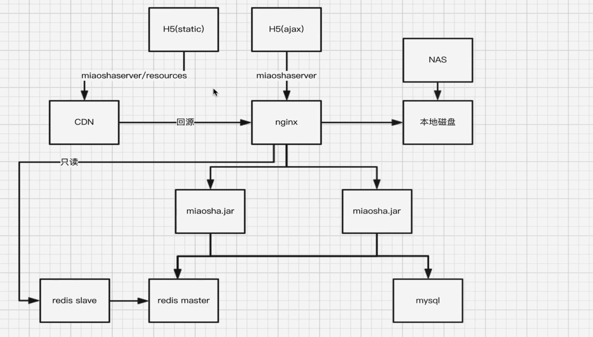
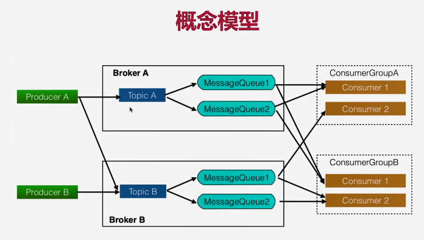

# online_bargain_dash_project
**秒杀项目**
##项目框架

本项目需要
- 一台服务器做redis+mysql+rocketMQ
- 一台服务器做nginx的反向代理服务器
- 两台服务器部署jar包程序
## 使用技术
1. mybatis
2. springboot
3. redis
4. nginx
5. rocketMQ
6. grava cache、grava ratelimit
7. lua 脚本

## 项目亮点

1. 前后端分离：
2. 分布式拓展

**各层对象模型：**

- controller：ViewObject(返回前端的对象)
- service:ViewModel
- DAO:DataObject
整体框架：
 

##运行设置：
更改本地的host文件， 添加nginx反向代理服务器 公网ip映射为miaoshaserver
ip miaoshaserver
### nginx服务器配置
1. 安装openresty
2. 进入 cd /usr/local/openresty/nginx/，将html等静态资源部署在/html/resource路径下
3. 配置nginx.conf
4. 配置lua 脚本
### rocketMQ配置

1. 修改mqnamesrv.sh mqbroker.sh mqadmin.xml内的jvm空间
2. broker.conf 增加一行brokerIP1=120.76.204.8（自己服务器的公网IP）
3. RocketMQ除了要开放9876和10911端口外，还需要开放10909和10912端口。
```shell
#开启rocketMQ,注意120.76.204.8需要修改成自己rocketMQ的公网ip地址
nohup sh bin/mqnamesrv &
nohup sh bin/mqbroker -n 120.76.204.8:9876 -c conf/broker.conf autoCreateTopicEnable=true &
#开启stock话题
./bin/mqadmin updateTopic -n 120.76.204.8:9876 -t stock -c DefaultCluster
#停止rocketMQ
sh bin/mqshutdown broker
sh bin/mqshutdown namesrv

```
###redis配置
修改redis.conf bind地址为本机内网地址
### mysql配置
允许其他ip以root用户访问数据库
```sql
grant all privileges on *.* to root@'%' identified by 'root'
flush privileges
```


